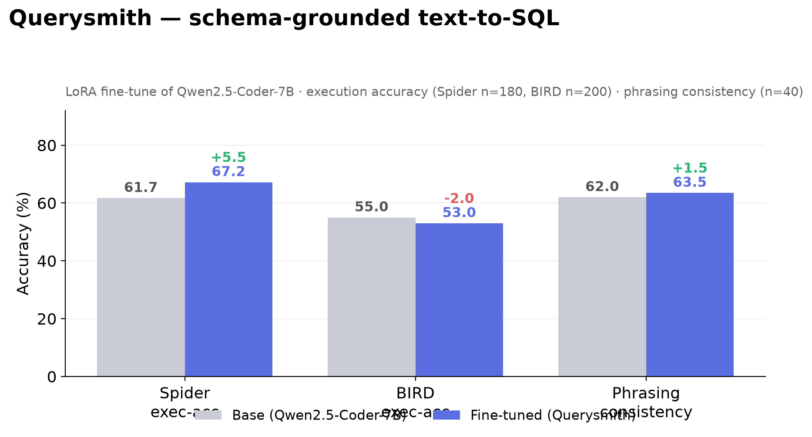

# Querysmith 🗄️ — schema-grounded text-to-SQL, with an honest investigation

Given a database schema and a plain-English question, Querysmith returns a SQLite
query. It's a LoRA fine-tune of `Qwen2.5-Coder-7B-Instruct`, trained and quantized on
Apple Silicon with [MLX](https://github.com/ml-explore/mlx), benchmarked with real
**execution accuracy** on [Spider](https://yale-lily.github.io/spider) and
[BIRD](https://bird-bench.github.io/).

It's deliberately a **full, honest pipeline**: a hypothesis from real-world experience,
a fine-tune, a rigorous eval that *tested* the hypothesis — and a clear-eyed account of
what did and didn't hold.



## The motivation

I used **Databricks Genie** (NL→SQL) via API and noticed it works well in its UI but
gets brittle when a question is phrased differently through the API. Hypothesis: a
fine-tuned, phrasing-robust model would close that gap.

## Results (execution accuracy — run the SQL, compare result sets)

| Metric | Base (7B) | Querysmith | Δ |
| --- | :---: | :---: | :---: |
| Spider exec-acc (n=180) | 61.7% | **67.2%** | **+5.5** |
| BIRD exec-acc (n=200) | 55.0% | 53.0% | −2.0 |
| Phrasing consistency (n=40) | 62.0% | 63.5% | +1.5 |

## What I learned

The robustness hypothesis was **not supported** — and the reason is the real finding:

> **Genie's brittleness lives in its retrieval / example-grounding layer, not in the
> base model's phrasing sensitivity.** A strong base model is already robust to surface
> paraphrases, so fine-tuning had little robustness headroom. The right fix for the
> Genie-API gap is better example-grounding/retrieval — not fine-tuning the model.

The model is still a useful, honestly-benchmarked text-to-SQL fine-tune (solid +5.5 on
Spider). Reporting a partly-refuted hypothesis *with the correct diagnosis* is the point.

## Artifacts
- 🤗 Model (MLX 4-bit): [`ajayk007/Qwen2.5-Coder-7B-Querysmith`](https://huggingface.co/ajayk007/Qwen2.5-Coder-7B-Querysmith)
- 📊 Dataset: [`ajayk007/querysmith-spider-bird`](https://huggingface.co/datasets/ajayk007/querysmith-spider-bird)

## Layout
```
data/download_data.py   # lean Spider+BIRD fetcher (pairs + schemas + dev DBs)
data/build_dataset.py   # schema-grounded chat format
config/lora_config.yaml # 7B LoRA (8 layers, 1536 seq, grad checkpoint)
eval/eval.py            # execution-accuracy (runs SQL vs gold against real DBs)
eval/robustness.py      # phrasing-robustness (consistency across paraphrases)
eval/watch_eval.py      # live eval dashboard
scripts/                # train / quantize / publish
```

## Reproduce
```bash
python3.11 -m venv .venv && source .venv/bin/activate
pip install -r requirements.txt
python data/download_data.py && python data/build_dataset.py
python scripts/watch_train.py            # fine-tune (live dashboard)
python eval/eval.py                      # execution accuracy
python eval/robustness.py                # phrasing robustness
```

## Eval methodology
Execution accuracy: run predicted + gold SQL against the real SQLite DB (with a
query-abort guard) and compare result sets, order-insensitive. Dev sets are sampled
across databases. Phrasing consistency: 5 surface paraphrases per question, measuring
how often the model stays correct across all of them.

## License
Apache-2.0 (code + model). Training data derives from Spider + BIRD (CC BY-SA 4.0).
